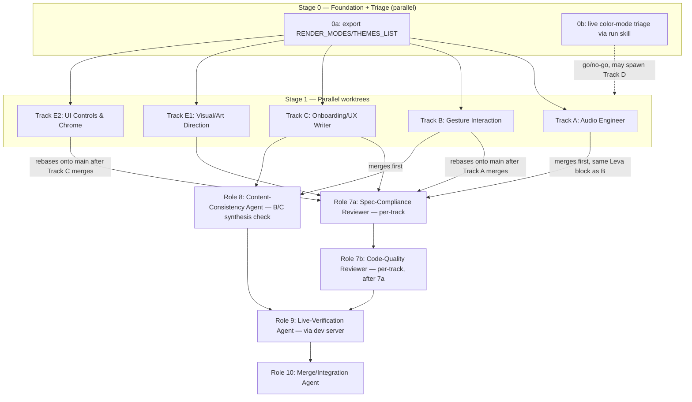
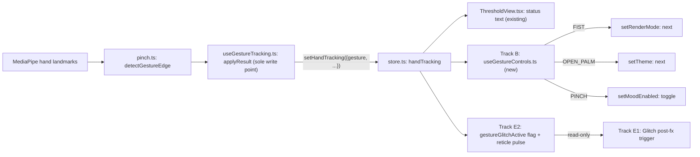

# Threshold — Phase 3 Sprint: Implementation Plan

**Naming note:** "Phase 3" (this document's title) refers to Threshold's own version history — Phase 1 (real gesture tracking) and Phase 2 (dither/brutalist visual reskin) are both already complete and merged into `main` (confirmed via `git log` merge commits `2ba146f`/`4b521c1` and `LOG.md`, both dated 2026-07-20). This sprint starts fresh work; it does not review or finish Phase 1/2. To avoid confusion with that versioning, this sprint's own internal sequencing below uses **Stage 0-4** (not "Phase 0-4").

## Context

Phase 2 (complete, merged) reskinned Threshold's render modes/themes/UI chrome toward a dither/halftone brutalist look. After living with it, the user found five gaps: audio "barely plays," detected hand gestures never drive anything beyond a status readout, onboarding is a single throwaway line, the boot screen's version label is stale, and a claim that only one render mode supports multi-color gradients needed live verification. A design doc capturing four of these as parallel sub-agent tracks was already brainstormed, written, and committed to `docs/plans/2026-07-22-threshold-phase3-sprint-design.md`.

The user then asked to fold in a fifth, larger track: a visual-polish pass toward "premium agency-grade, gaming-studio-grade" production value — built further on Phase 2's existing dither/brutalist direction (not replacing it), blending two confirmed reference cues: military/industrial HUD tech (reticles, tick-mark rulers, phosphor-CRT precision) and synthwave/analog (neon glow, VHS glitch, warm gradient accents). Scope covers both the 3D scene (lighting/materials/post-fx) and UI chrome (typography/spacing/micro-interactions) end to end.

This plan is the single execution document for the full sprint: the four already-designed tracks plus this new visual-polish track, sequenced to avoid the one real file-overlap risk between them.

## Tech stack (confirmed, no new dependencies)

Everything this sprint needs is already installed at the repo root (`package.json`) — no dependency additions, upgrades, or new tooling:

| Layer | Package | Version |
|---|---|---|
| Framework | `next` | ^15.2.4 |
| UI | `react` | ^19.2.5 |
| Language | `typescript` | ^5.8.0 |
| 3D | `three` / `@types/three` | ^0.184.0 |
| 3D React binding | `@react-three/fiber` | ^9.6.1 |
| 3D helpers | `@react-three/drei` | ^10.7.7 |
| Post-processing | `@react-three/postprocessing` | ^3.0.4 |
| State | `zustand` | ^5.0.12 |
| Audio | `tone` | ^15.1.22 |
| Debug/control panel | `leva` | ^0.10.1 |
| Styling | `tailwindcss` | ^3.4.19 |
| Hand tracking | `@mediapipe/tasks-vision` | ^0.10.35 |
| Unit tests | `vitest` | ^4.1.10 |

All new post-fx (`HueSaturation`, `DepthOfField`, `Glitch`) ship in the already-installed `@react-three/postprocessing@^3.0.4` — verified by Track E1's plan section. `@xenova/transformers` (depth estimation) is legacy/unused, untouched by this sprint.

## Process & tooling decisions

Answering the four process questions explicitly, each with a recommendation grounded in this repo's own precedent (Phase 1 and Phase 2 of this same experiment):

| Question | Recommendation | Why |
|---|---|---|
| **ADR: new or updated?** | **No new ADR.** | `docs/adr/` (0001-0003) holds only repo-wide architectural decisions (context tiers, static export, per-experiment isolation). Phase 1 (real gesture tracking) and Phase 2 (full visual reskin) — both larger than any single Phase 3 track — did not get ADRs. This sprint doesn't change repo architecture, only one experiment's internals. |
| **PRD / TRD: formal docs?** | **No new formal docs.** The already-committed `docs/plans/2026-07-22-threshold-phase3-sprint-design.md` is the PRD-equivalent (problem, scope, current-state findings, user-confirmed decisions); this plan file is the TRD-equivalent (architecture, tracks, sequencing, testing). | Matches "Creative Lab Mindset" (memory: loose process, don't over-engineer experiment work) and the two existing `docs/plans/*-design.md` docs, which serve exactly this dual role already. |
| **Branch or worktree?** | **Worktree per track**, plain `git worktree add`, root `.worktrees/` (already gitignored per `b667cdb`). | Phase 1 and Phase 2 both used exactly this shape (commit `aebabde` "checkpoint... before Phase 1 worktree"; Phase 2's Task A/Task B merge commits). Five tracks touching overlapping files (`ThresholdView.tsx`) need filesystem isolation, not just branch isolation, to run truly in parallel. Worktree mechanics are tool-agnostic — Kilo Code's Orchestrator mode `cd`s each delegated subtask into its own worktree path same as any shell-driven workflow would. |
| **Visual styleguide / reference doc?** | **Yes — one lightweight `VISUAL_STYLEGUIDE.md`**, delivered as part of Track E2. | This sprint introduces a named 6-tier typography scale, a fixed post-fx ordering, and two blended reference languages (HUD/military + synthwave/analog) — exactly the kind of decision that's cheap to write down once and expensive to reverse-engineer from CSS later. Scoped to Threshold only, not a repo-wide design system (per-experiment isolation, ADR 0003). |

Worktree naming: `.worktrees/threshold-phase3-{track}` (e.g. `threshold-phase3-audio`, `threshold-phase3-gestures`, `threshold-phase3-onboarding`, `threshold-phase3-scene-polish`, `threshold-phase3-chrome-polish`), one per track, branched from `main`.

## Execution tool & model assignment (Kilo Code)

This sprint executes in **Kilo Code**, not Claude Code — the plan below is written against Kilo's mode/model system rather than Claude Code's Agent tool + superpowers skills. Kilo Code lets you assign a model per **mode** (Code, Ask, Debug, Architect, Orchestrator, custom modes) and per **tier** (Default, Small, Sub-agent, Auto-complete); Orchestrator mode is what dispatches the numbered pipeline below as delegated subtasks, each subtask running in whichever mode/model fits its job.

**Model decision (locked): all dispatched sub-agents inherit the current turn's model — `z-ai/glm-5.2`.** No per-role model override is applied. Each Agent Manager task below omits `model`/`variant` so it inherits the current turn's selection. This keeps dispatch simple and matches Agent Manager's default inheritance. (The earlier draft's per-tier/per-mode table — Claude Sonnet 5 for Architect/Debug, GLM 5.2 Air for Small, etc. — is superseded by this single inheritance decision; it is retained only as a reference fallback if a future run wants per-role tuning.)

**Note on the earlier model survey:** user-provided screenshots of Design Arena and OpenRouter (JS-rendered SPAs the automated fetch couldn't capture) were reviewed directly. Findings: Claude leads raw Elo/capability across nearly all Design Arena categories; GLM 5.2 leads adoption/usage-share metrics on both sites. **"Kimi K3" does not appear on either leaderboard — only Kimi K2.7/K2.8 exist** — so earlier Kimi K3 references were removed as unverified/likely-nonexistent. These findings informed the inheritance choice but no longer drive a per-role split.

## Agent pipeline (11 roles, Kilo Code Orchestrator-dispatched)

Eleven distinct delegated subtasks — the earlier 7-role draft consolidated review onto one QA agent; this expands review into a **two-stage gate per track** (spec-compliance reviewer 7a, then code-quality reviewer 7b, per the `subagent-driven-development` skill) plus separate Content-Consistency (8), Live-Verification (9), and Merge/Integration (10) roles. All roles inherit the current turn's model (GLM 5.2); no per-role model override.

| # | Role | Stage | Kilo mode | Scope |
|---|---|---|---|---|
| 1 | **Setup Agent** | Stage 0a + 0b | Architect → Code | Export `RENDER_MODES`/`THEMES_LIST`; drive dev server, live-triage the color-mode claim, go/no-go on Track D |
| 2 | **Audio Engineer** | Track A | Code (Debug for root-cause confirmation) | `audio.ts` only — `ensureAudioContext()` gate, shared synth reuse |
| 3 | **Gesture Interaction** | Track B | Code | new `useGestureControls.ts`, additive `store.ts`, Leva monitor row, unit tests |
| 4 | **Onboarding/UX Writer** | Track C | Code | new `OnboardingOverlay.tsx`, boot-screen version bump |
| 5 | **Visual/Art Direction** | Track E1 | Code | `Scene.tsx` materials, `ThresholdView.tsx` lights/post-fx |
| 6 | **UI Controls & Chrome** | Track E2 | Code | `ThresholdView.tsx` chrome/typography, `threshold.module.css`, `VISUAL_STYLEGUIDE.md` (rebases onto main after Track C merges — see sequencing rule). Loads `frontend-design` base + selective `high-end-visual-design` borrow (motion/perf only, anti-patterns excluded) |
| 7a | **Spec-Compliance Reviewer** | Stage 2 | Architect | Per-track: does the diff match this track's plan spec exactly — nothing missing, nothing extra. Runs *before* 7b. Per-track, parallel across tracks. |
| 7b | **Code-Quality Reviewer** | Stage 2 | Architect | Per-track: code quality only (after 7b clears spec). Re-review until clean. Per-track, parallel across tracks. |
| 8 | **Content-Consistency Agent** | Stage 2 | Architect | B↔C check only: does Track C's onboarding step 4 accurately describe Track B's final gesture→action mapping |
| 9 | **Live-Verification Agent** | Stage 3 | Debug (drives the actual dev server) | Runs the full verification checklist below against the live app, `vitest run` |
| 10 | **Merge/Integration Agent** | Stage 4 | Code | Merges in sequence (A, B, C, E1, E2 last), resolves the one expected rebase, deletes worktrees |

Dispatch pattern for Stage 1 (roles 2-6): Orchestrator delegates all five in parallel, each pointed at its own worktree and given only its track's section of this plan plus the shared critical-files list below — same parallel-worktree shape Threshold's own Phase 1/Phase 2 already used successfully (per `LOG.md`: "Executed via subagent-driven parallel worktree framework"), just dispatched through Kilo's Orchestrator instead of Claude Code's Agent tool.

Stage 2 review pattern (roles 7a→7b→8): each track clears 7a (spec) then 7b (quality) sequentially *within* the track; tracks run their review pairs in parallel since worktree isolation prevents interference. Role 8 (B↔C content) runs only after both B and C have individually cleared 7b. Implementer subagents fix flagged issues and re-review until clean — never skip the re-review loop.

## Skills to load before Stage 1

Two skills are relevant to this sprint's visual tracks. `frontend-design` is already installed at the repo's `.agents/skills/frontend-design`; `high-end-visual-design` is installed at the user-global `~/.kilocode/skills/high-end-visual-design`. **Per the locked visual-skill decision, only Track E2 loads these** (Track E1 is 3D/R3F/post-fx — neither skill covers that, it leans on documented stack knowledge):

| Skill | Source | Role that loads it | How it's used |
|---|---|---|---|
| `frontend-design` | `anthropics/skills` (already at repo `.agents/skills/`) | Track E2 (UI Controls & Chrome) | **Base** — context-flexible; accepts the brutalist/raw HUD direction and commits to a bold aesthetic point-of-view. Drives typography/reticle/glitch/neon-glow craft. |
| `high-end-visual-design` | `leonxlnx/taste-skill` (already at `~/.kilocode/skills/`) | Track E2 (UI Controls & Chrome) | **Selective borrow only** — motion choreography (custom cubic-beziers, transform/opacity-only animation), the Double-Bezel "machined-hardware" cue reinterpreted as industrial panels (not glassmorphism), and performance guardrails (GPU-safe animation, z-index discipline). **Its banned-font / banned-border / `py-24` whitespace / premium-glassmorphism anti-pattern list is explicitly excluded** — it conflicts with Phase 2's established dither/halftone brutalist HUD look. |

No marketplace skill covers Three.js/R3F/shader work (Track E1's 3D side) or Tone.js/audio (Track A) — those lean on the tech-stack knowledge already documented in this plan. Both named skills are already installed; no `npx skills add` step is needed before Stage 1.

## Flow diagrams

**Phase/task flow:**

**Gesture data flow (the mechanism Track B/E1/E2 all hook into):**

### Sequencing rule (the one real conflict in this sprint)

Tracks C and E1 are conflict-free with everything else — different files or disjoint line ranges within `ThresholdView.tsx` (C touches only the boot-screen/onboarding block ~280-383; E1 touches only lighting/post-fx config ~154-204, ~486-499). **Track E2 must rebase onto main *after* Track C merges, immediately before E2's code review** — Track C physically extracts the onboarding JSX (347-383) into `OnboardingOverlay.tsx` and edits the version string inside the same boot-screen block (284) that E2's typography scale restyles. Rebasing E2 after C is cheap (C's diff is small); forcing C to rebase around E2's larger typography diff would not be. Concretely: E2 applies its typography classes to `OnboardingOverlay.tsx` (Track C's new file), not to the now-deleted inline onboarding JSX.

**A second real overlap, found on verification (not in the original design doc): Track A and Track B both touch `ThresholdView.tsx` inside the same Leva `useControls` block.** Direct read confirms the whole Leva panel — every folder from `Signal` through `Audio` — spans lines 231-278, and Track A's one required edit (replacing the "Audio > enabled" toggle's inline `Tone.start()` at line 266 with a call to Track A's new `ensureAudioContext()` gate) sits inside that same range Track B claims for its new monitor row. Two worktree branches editing the same ~48-line block from the same starting commit is a real textual-merge-conflict risk, not just a theoretical one. Resolution: **merge Track A before Track B** (Track A's diff there is one line; Track B's is a new row addition, easier to rebase around a landed one-liner than the reverse), and Track B's own worktree should rebase onto main immediately before its code review, mirroring the E2-after-C pattern above. Stage 4 merge order updates to: **A, B, then C, E1, E2 last** (E2 still rebases after C per the original rule).

One deliberate shared read (not a write conflict): E1's `Glitch` post-fx trigger and E2's DOM glitch/reticle both react to `handTracking.gesture` edges — the same read-only store field Track B's `useGestureControls.ts` also consumes. E2 owns a `gestureGlitchActive` boolean (it already needs a `useEffect` on the gesture for the reticle pulse); E1 just reads that boolean. No writes back into Track B's files from either.

## Stage 0a — Foundation

Export `RENDER_MODES` and `THEMES_LIST` as ordered arrays from `store.ts` (today the equivalent `modeList` lives inline in `ThresholdView.tsx`). Existing keyboard shortcuts (`ThresholdView.tsx:206-229`) switch to importing the same arrays — no behavior change. Track B's gesture-cycling hook consumes the same source of truth instead of duplicating or reaching into component internals.

**One decision Setup Agent must make explicitly, found on verification:** the inline keyboard `modeList` (`ThresholdView.tsx:210`: `['radio','dots','blocks','lines','ascii','pixel','spectral']`) and the Leva render-mode dropdown's `options` array (`ThresholdView.tsx:248`: `['pixel','radio','blocks','dots','lines','ascii','spectral']`) are already in **different orders** today — a pre-existing inconsistency, not introduced by this sprint. Exporting a single canonical `RENDER_MODES` array means picking one order (recommend matching the keyboard list, since "1-7" key-to-mode mental mapping is more load-bearing than dropdown item order) — this also becomes the cycle order Track B's FIST gesture steps through, so the choice is now user-visible in two places instead of one.

## Stage 0b — Color-mode live triage

Use the `run` skill to start the dev server, cycle all 7 render modes × 4 themes, and confirm directly whether multi-color gradients render for the 6 modes the code (`Scene.tsx:237`, `getGradientColor`) claims support them — a prior static-analysis pass already found this likely holds, with only `ascii` deliberately excluded by design. If confirmed, this stage's output is a documented confirmation and Track D is skipped. If a real runtime bug turns up, Track D is scoped then, against whatever the live check actually finds.

## Track A — Audio Engine Repair (`experiments/threshold/src/audio.ts` + one line in `ThresholdView.tsx`)

Root cause of "barely plays": three separate call sites in `audio.ts` (lines 135-137, 176-178, 201-203) each do `await Promise.race([Tone.start(), timeout(500)])` without ever checking `Tone.context.state` afterward — on an unsatisfied browser autoplay gate, synth setup proceeds against a suspended context and playback silently fails. **A fourth site exists outside `audio.ts`**: the Leva "Audio > enabled" toggle's `onChange` handler (`ThresholdView.tsx:263-269`) already calls `Tone.start().catch(() => {})` directly — confirmed via direct read, not counted in the original "three call sites" tally. This is exactly the real-user-gesture entry point Track A's gate needs, so it isn't a new problem, but the file scope below must include this one line, not just `audio.ts`.

- Replace all three `audio.ts` sites with one shared `ensureAudioContext()` gate (exported from `audio.ts`) that awaits real context resume (`Tone.context.state === 'running'`). Replace the toggle's inline `Tone.start().catch(() => {})` at `ThresholdView.tsx:266` with a call to this same exported gate — the one, single-line, necessary edit to `ThresholdView.tsx` this track makes.
- The soundTexture effect and mood/phase effect stop independently racing `Tone.start()`; both check the shared gate instead.
- Replace the per-rhythm-hit `MembraneSynth` create/dispose churn (`audio.ts:281-289`, new synth every loop iteration, disposed via `setTimeout(..., 500)`) with one reused synth instance — removes the disposal race that drops notes.
- No changes to instrument choice, timbre, envelope design, or mix (confirmed a reliability bug, not a taste issue).

## Track B — Gesture-Reactive Controls (new `useGestureControls.ts` + additive `store.ts` + one Leva monitor row)

`handTracking.gesture` (`store.ts:136-143`, written by `useGestureTracking.ts:166-174`) is computed every frame today but never consumed beyond a status string (`ThresholdView.tsx:146-149`) — the onboarding copy's "TRIGGERS A MOMENT" promise is currently unimplemented.

Mapping (edge-triggered, reusing the existing one-shot `detectGestureEdge` semantics so a held gesture doesn't rapid-fire):

| Gesture | Action |
|---|---|
| FIST | cycle to next render mode (Phase 0a's `RENDER_MODES`) |
| OPEN PALM | cycle to next theme (Phase 0a's `THEMES_LIST`) |
| PINCH | toggle mood on/off (`setMoodEnabled`) |

New, isolated `useGestureControls.ts` hook watches `handTracking.gesture` and calls the existing `setRenderMode`/`setTheme`/`setMoodEnabled` setters — no new state shape, just a new consumer of the existing write point. Add one read-only Leva monitor row (existing `useControls` idiom) bound to `handTracking.gesture`/`gestureTrackingStatus`, so the panel visibly reflects the gesture that just fired.

## Track C — Onboarding Walkthrough + Version Bump

Extract the current single-line onboarding overlay (`ThresholdView.tsx:347-383`, gated by the `localStorage` flag at line 162) into a new `OnboardingOverlay.tsx` component, sequenced as:

1. What Threshold is (one line)
2. Camera/gesture permission context
3. Try FIST / OPEN PALM / PINCH — live detection feedback, reusing the existing per-gesture swatch colors (green/cyan/orange, preserved as semantic per Phase 2)
4. Gestures now also cycle modes/themes/mood — documents Track B's mapping (the cross-track content dependency Phase 2's synthesis pass must verify against B's final mapping)
5. Modes & themes exist — press 1-7, T (documents pre-existing keyboard shortcuts)
6. Dismiss → same `localStorage` flag, plus a persistent "?" icon to replay

Version bump: `THRESHOLD V5` → `THRESHOLD V6` (`ThresholdView.tsx:284`), bundled here since it's the same boot-screen region already being touched.

## Track E1 — 3D Scene & Post-FX Polish

**Lighting** (`ThresholdView.tsx:496-497`, inside `<Canvas>`):
- Add a cool rim/key `directionalLight` opposite the existing warm `pointLight`: `position={[-8, 6, -10]} intensity={0.4} color={palette.accent}` — no rim/fill light exists today, so this is the single highest-leverage change for depth separation.
- Give the existing static `pointLight` a slow sine positional drift (±0.5 units, ~0.1Hz) — reinforces the "analog gear never perfectly still" cue.
- Add `<fog attach="fog" args={[palette.background, 15, 45]} />` after `ThresholdView.tsx:488` — no fog exists today; reinforces the existing `Grid` depth cue with a CRT-edge falloff.

**Materials** (`Scene.tsx:75-95, 292-319`): no change to the existing mood-phase roughness/metalness table. Add a small per-cell emissiveIntensity flicker (±3%, seeded once per resolution change) on top of the existing audio+breath modulation, for phosphor-flicker authenticity — roughness/metalness values themselves stay untouched.

**Post-processing** (`ThresholdView.tsx:489-495`, inside `EffectComposer` — all effects below are already available in the installed `@react-three/postprocessing@^3.0.4`, no version bump):
1. `HueSaturation` (saturation ≈ +0.15, constant) — inserted after `Bloom`, before `ChromaticAberration` — neon-punch boost for acid/heatmap palettes.
2. `DepthOfField` (focusDistance from the existing camera lerp target, bokehScale ~2-3) — inserted after `ChromaticAberration`, before `Scanline` — the literal cinematic/military-optics focus cue.
3. `Glitch` (currently imported nowhere, near-zero ratio/delay by default) — forced into a 150-250ms burst whenever E2's `gestureGlitchActive` flips true — inserted before `Scanline`. This is the literal VHS-glitch cue and the deliberate synergy point with Track B's gesture edges (read-only consumption, no write into Track B's files).
4. Existing `Scanline`, `Noise`, `Vignette` stay as-is.

Explicitly out of scope (available but not warranted): `ASCII`, `Pixelation`, `DotScreen`, `Sepia`, `Outline`, `TiltShift`, `ShockWave`, `LensFlare`, `ColorDepth`, `N8AO`, `GodRays`, `LUT`, `Ramp`.

## Track E2 — UI Chrome & Typography Polish

**Scoping decision (per user correction on verification):** all of this track's new CSS goes into a new `experiments/threshold/src/threshold.module.css` (Next.js CSS Modules), imported directly into `ThresholdView.tsx`/`OnboardingOverlay.tsx` — **not** the shared `app/globals.css`. AI Musings is a collection of separately-styled experiments; CSS Modules auto-scope every class name at build time, so nothing in this file can leak into other experiments regardless of import order, and no other experiment inherits Threshold's HUD look because of this sprint. (Scope note: this fixes only *this sprint's new* classes. The pre-existing global `.hud-overlay`/`.hud-scanline`/`.vignette` in `app/layout.tsx` already apply to every experiment today, independent of this sprint — user has explicitly deferred that broader fix to later, tracked outside this plan.)

**Typography scale** — six named classes added to `threshold.module.css`, replacing the current ad hoc `text-[8px]/[9px]/[10px]/xs/sm/lg/3xl` mix:

| Class | Size | Tracking | Weight | Used for |
|---|---|---|---|---|
| `.hud-micro` | 8px | 0.25em | 500 | corner-bracket ruler ticks, mood-swatch labels |
| `.hud-caption` | 10px | 0.2em | 500 | status bar, depth-meter/timer, signal-bar readout |
| `.hud-body` | 11px | 0.15em | 400 | onboarding body copy |
| `.hud-label` | 13px | 0.3em | 700 | button labels, toggle labels |
| `.hud-heading` | 15px | 0.3em | 700 | section headers |
| `.hud-display` | 32px | 0.3em | 800 | boot-screen `<h1>` |

Applied to `ThresholdView.tsx:54` (`SessionTimer`), `284-337` (boot screen — **after** Track C's version-string edit lands), `389-478` (chrome), and — once Track C has merged — `OnboardingOverlay.tsx`.

**Corner brackets → tick-mark ruler** (`ThresholdView.tsx:395-400`): add 3-4 small 1px perpendicular tick divs at 25/50/75% along each existing bracket arm, in `palette.accentDim` — pure CSS geometry addition, no new component.

**Signal-strength bar** replacing the raw confidence percentage: verified the confidence value is not an isolated element today — it's interpolated inline into a larger compound string (`ThresholdView.tsx:148`, inside `displayStatusText`, e.g. `"HAND FIST 87%"`), which the status bar (`443-447`) then renders as plain text. Swapping in a 5-segment bar (`Math.ceil(confidence*5)` lit divs in `palette.accent`, rest dim, numeric value kept as a `title` attribute) requires restructuring `displayStatusText`'s construction to separate the gesture/status label from the confidence value, not a drop-in replacement at a single call site.

**Targeting reticle** bound to hand position (new, in the existing overlay layer near `ThresholdView.tsx:395-400`): absolutely-positioned crosshair with `left/top` driven by `handTracking.wrist.x/y` (already normalized 0-1 via `wrist-mapping.ts` — no 3D projection needed), shown only when a hand is detected/active, pulsing through the existing per-gesture swatch colors on each gesture edge — the most literal fusion of the military-reticle cue with the hand-tracking pipeline.

**VHS glitch trigger** (owned here, read by E1): a `gestureGlitchActive` boolean, flipped true briefly on each `handTracking.gesture` edge, toggling a new Threshold-scoped `.glitchActive` class (in `threshold.module.css`) onto the status-bar text — a standalone rule (not editing the shared `app/globals.css:59-62` `.glitch-text:hover` rule), reproducing the same glitch text-shadow effect but keyed on the module class instead of `:hover`, since a programmatic trigger can't rely on `:hover`.

**Neon-glow accents:** new `.neonGlow` utility (`box-shadow: 0 0 8px currentColor`, in `threshold.module.css`) applied to the depth-meter bar and mood-toggle button, extending the existing magenta/cyan/orange edge-panel gradients already present rather than inventing new colors.

**CRT classes are already global, not "unused" — guardrails, corrected:** direct read of `app/layout.tsx` confirms all three of `.hud-overlay` (line 18), `.hud-scanline` (line 19), and `.vignette` (line 20) are already mounted on every page via the root layout — none of them are dormant/unused today, including on Threshold's own route. **Do not** re-apply `.hud-overlay` or `.hud-scanline` inside Threshold's own component tree (both already blanket every page from the root layout — doubling either would over-darken, same reasoning as the vignette case below, just previously uncaught for these two). **Do not** apply the `.vignette` CSS class (`globals.css:94-97`) — it would stack with the already-present R3F `Vignette` post-effect and double-darken the frame. Net effect: Track E2 does not need to (and must not) mount any of these three classes a second time inside Threshold — the CRT-overlay/scanline/vignette baseline is already inherited for free; Track E2's job is typography/reticle/glitch/neon-glow only.

## Testing strategy

- **Track A**: no meaningful unit-test surface (real `AudioContext`) — verified live in Stage 3 by toggling audio and confirming sustained, non-dropped playback across a texture switch and a mood change.
- **Track B**: the gesture→next-mode/theme cycling logic is a pure function — unit-testable alongside the existing `theme.test.ts`/`dither.test.ts` pattern in `src/__tests__/`.
- **Track C, E1, E2**: no meaningful unit-test surface — manual/live verification only (walkthrough steps, lighting/post-fx visual pass, typography/reticle/glitch behavior).
- Stage 0b and Stage 3 both use the `run` skill to drive the actual dev server rather than relying on static review alone.

## Verification (Stage 3, end to end via `run`)

- Audio: enable toggle → sustained playback survives a soundTexture switch and a mood-phase change with no dropped notes.
- Gestures: FIST/OPEN PALM/PINCH each visibly change mode/theme/mood, Leva monitor row reflects the fired gesture, existing keyboard shortcuts (1-7, 0, m) still work unregressed.
- Onboarding: all 6 steps render in order, dismiss persists via `localStorage`, "?" icon replays it.
- Boot screen reads `THRESHOLD V6`.
- Color triage: documented conclusion for all 7 modes × 4 themes (bug confirmed/refuted).
- Visual polish: rim light + fog visible in volumetric view, DoF/glitch/hue-saturation read correctly across all 4 themes, reticle tracks hand position and pulses on gesture edges, typography scale applied consistently (no leftover one-off px values), no double-vignette/double-scanline stacking.
- `vitest run` passes (existing + new gesture-cycling tests).

### Critical files

- `experiments/threshold/src/store.ts` — Phase 0a exports; Track B additive setters (existing)
- `experiments/threshold/src/audio.ts` — Track A
- `experiments/threshold/src/ThresholdView.tsx:263-269` (one line, the Leva "Audio > enabled" toggle) — Track A; **merges before Track B** since both touch the same Leva `useControls` block (see sequencing rule)
- `experiments/threshold/src/useGestureControls.ts` (new) — Track B
- `experiments/threshold/src/vision/useGestureTracking.ts` — reference only, not modified
- `experiments/threshold/src/OnboardingOverlay.tsx` (new) — Track C
- `experiments/threshold/src/Scene.tsx` — Track E1 (materials/lighting-reactive logic)
- `experiments/threshold/src/ThresholdView.tsx` — Track B (hook call + Leva row), Track C (boot screen/version), Track E1 (lights/post-fx), Track E2 (typography/chrome) — see sequencing rule above
- `experiments/threshold/src/threshold.module.css` (new, CSS Modules — Track E2's scoping fix per user correction) — Track E2 (typography classes, `.glitchActive`, `.neonGlow`); **not** `app/globals.css` (repo-root, shared across every experiment — deliberately untouched by this sprint)
- `experiments/threshold/src/vision/wrist-mapping.ts` — reference only, reticle position source
- `experiments/threshold/src/theme.ts` — reference only, palette source for both E1/E2
- `experiments/threshold/src/__tests__/` — new gesture-cycling unit test (Track B)
- `experiments/threshold/VISUAL_STYLEGUIDE.md` (new) — Track E2 deliverable: typography scale table, post-fx ordering, HUD/synthwave reference language

## Task-list phasing review

Re-checked the Stage 0→4 structure for gaps and ordering correctness:

- **Stage 0 must fully complete before Stage 1 starts** — every Track A-E2 agent needs 0a's exported arrays available in `main` before branching its worktree; 0b's go/no-go determines only whether a 6th agent (Track D) gets spawned, it does not block A/B/C/E1/E2.
- **Within Stage 1, all five tracks branch from the same `main` commit** (post-0a) and run fully in parallel — no track depends on another's Stage-1 output, confirmed by the file/line-range disjointness check in the sequencing rule above.
- **Merge order inside Stage 4 is not arbitrary**: Track A must merge before Track B rebases (both touch the same Leva `useControls` block, found on verification — see sequencing rule), and Track C must merge before Track E2 rebases (original sequencing rule). Stage 4 merges in this order: **A, B, C, E1, then E2 last** — E1 has no ordering constraint relative to any other track and can land anywhere after A.
- **Stage 2 (review)**, split across roles 7a (Spec-Compliance Reviewer), 7b (Code-Quality Reviewer), and 8 (Content-Consistency Agent), happens per-track as each track's specialist finishes — per track, 7a clears before 7b (the mandated spec→quality order); tracks run their 7a/7b pairs in parallel thanks to worktree isolation. Role 8's B↔C content-synthesis check can only run once both B and C have individually cleared 7b.
- Role 9 (Live-Verification) waits for all of 7a, 7b, and 8 to clear all tracks; role 10 (Merge/Integration) waits for role 9.
- This ordering is now reflected in the Mermaid stage-flow diagram above (`TC -->|merges first|`, `TE2 -->|rebases onto main after Track C merges|`, roles 7/8 feeding into role 9 feeding into role 10).

## Confirmed decisions (locked, pre-execution)

Resolved by direct code inspection / repo precedent + user confirmation:
- Tech stack — confirmed, no new dependencies.
- File-overlap/conflict risk across tracks — confirmed, two real overlaps (E2/C and A/B), both handled by rebase-after-merge (see sequencing rule).
- Root cause of the audio bug — confirmed via direct code reading (autoplay-gate race).
- Gesture→action mapping — confirmed via prior brainstorming Q&A.

Locked by user confirmation:
- **No new ADR** — sprint changes one experiment's internals, not repo architecture; matches Phase 1/2 precedent.
- **No formal PRD/TRD** — existing design doc + this plan file already serve that role.
- **Worktree-per-track** (not a single shared branch) — five tracks touch overlapping files, need filesystem isolation.
- **New `VISUAL_STYLEGUIDE.md`** as a Track E2 deliverable.
- **Two-stage review per track** — role 7 expanded into a spec-compliance reviewer subagent (7a) *then* a code-quality reviewer subagent (7b), sequential within each track, parallel across tracks (see Agent pipeline + Stage 2). This replaces the earlier single "Code Reviewer" pass and aligns with the `subagent-driven-development` skill's mandated review order (spec first, quality second, re-review until clean).
- **Sub-agent model: inherit current model (GLM 5.2)** for all dispatched tracks/roles — no per-role model override. Agent Manager tasks omit `model`/`variant` so they inherit the current turn's selection.
- **Visual skill binding for Track E2**: implementer loads `frontend-design` as the base (context-flexible, accepts the brutalist/raw HUD direction), and *selectively borrows* from `high-end-visual-design` only its motion choreography (custom cubic-beziers, transform/opacity-only animation), Double-Bezel-as-physical-hardware cue (reinterpreted as machined industrial panels, not glassmorphism), and performance guardrails. **The `high-end-visual-design` banned-font / banned-border / `py-24` whitespace / premium-glassmorphism anti-pattern list is explicitly NOT applied** — it conflicts with Phase 2's established dither/halftone brutalist HUD look. Track E1 (3D/R3F/post-fx) loads no visual skill (both are DOM/CSS-oriented); it leans on documented stack knowledge per its track spec.

Nothing else is blocking execution.
